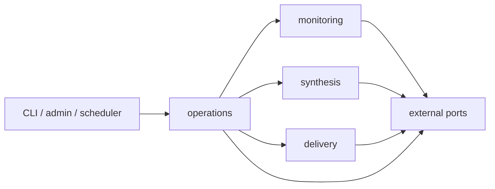

# Архитектурные границы

**Статус:** утверждено  
**Владелец фактов:** архитектурная цель, четыре модуля и разрешённые зависимости  
**Читать когда:** меняются модули, ответственность, импорты или composition root  
**Связанные документы:** [карта архитектурной документации](README.md)

## Архитектурная цель

V1 должна надёжно провести каждый подходящий Telegram-элемент через четыре шага:

```text
capture → synthesis → delivery → cursor advance
```

Архитектура обязана:

- не терять зафиксированные элементы при сбое или перезапуске;
- не продвигать локальный cursor раньше полной подтверждённой доставки плана;
- позволять безопасно продолжить частично завершённый запуск;
- сохранять предметное ядро синтеза независимым от Telegram;
- оставаться достаточно простой для локальной установки одного пользователя.

Масштабирование на несколько машин, динамические плагины, универсальная интеграционная платформа и заранее реализованные адаптеры будущих платформ не являются целями v1.

## Принятое решение

Система строится как Telegram-first модульный монолит из четырёх модулей:

1. `monitoring` — источники, фиксация новых элементов и подтверждение обработанного диапазона;
2. `synthesis` — бизнес-правила систематизации и платформенно-нейтральный результат;
3. `delivery` — неизменяемый план и доставка в Telegram;
4. `operations` — единственный координатор полного запуска, восстановления и отмены.

Админ-панель, CLI и Windows Task Scheduler являются тонкими точками входа. `setup` — пользовательский сценарий настройки, а `scheduling` — конфигурация интервала и системный адаптер; отдельными предметными модулями они не являются.

Для post-v1 агентской интеграции выбрано направление MCP. V1 не содержит MCP-сервера и не резервирует для него отдельный предметный модуль.

Внутри одного процесса выполняется один последовательный координатор. Фоновые очереди, воркеры, брокер сообщений, event sourcing и распределённые блокировки не нужны.

## Модули и ответственность

### `monitoring`

Модуль владеет:

- обнаружением доступных Telegram-источников;
- сохранённым выбором отслеживаемых источников;
- открытием неизменяемого `CaptureBatch`;
- нормализацией Telegram-публикаций в `ContentItem`;
- bootstrap-политикой при первом и повторном включении источника;
- хранением и идемпотентным продвижением локального cursor.

Он не знает правил тегов, рекламы, резюме и форматирования доставки.

### `synthesis`

Модуль владеет:

- пользовательской политикой синтеза;
- классификацией рекламы;
- тегами, ранжированием и межпоточным объединением;
- выявлением конфликтов;
- резюме и `model_view`;
- пакетированием запросов к LLM;
- проверкой полноты и валидности модельного результата;
- платформенно-нейтральным `SynthesisResult`.

Он получает нормализованные элементы и не обращается к Telegram, хранилищу запуска или доставке.

### `delivery`

Модуль владеет:

- проверкой цели доставки;
- преобразованием `SynthesisResult` и предупреждений в `DeliveryUnit`;
- построением неизменяемого `DeliveryPlan`;
- финальным Telegram-текстом и entities;
- разбиением на сообщения;
- назначением стабильного `random_id`;
- отправкой одного сообщения;
- `DeliveryReceipt`.

Он не решает, какие источники читать, и не продвигает их состояние.

### `operations`

Модуль владеет полным жизненным циклом запуска:

- захватом единственного системного mutex;
- последовательным вызовом трёх предметных модулей;
- порядком сохранения фактов;
- восстановлением после перезапуска;
- повторами внешних операций;
- кооперативной отменой;
- безопасными проблемами и уведомлениями;
- `RunResult`.

`operations` не дублирует предметные правила остальных модулей.

## Правило зависимостей



Правила:

- точки входа вызывают только публичный API `operations` либо узкие административные команды владельца данных;
- `operations` зависит от публичных API `monitoring`, `synthesis` и `delivery`;
- предметные модули не вызывают друг друга и не зависят от `operations`;
- платформенные SDK доступны только через внешние порты и адаптеры;
- внутренние репозитории и реализации одного модуля не импортируются другим.

Композиционный корень явно собирает реализации. Runtime discovery, реестр плагинов и динамическая загрузка модулей запрещены.

